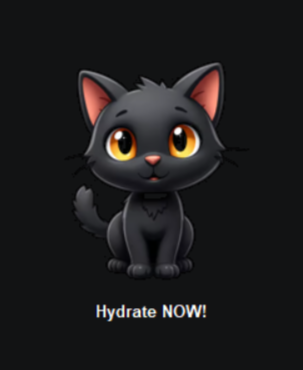
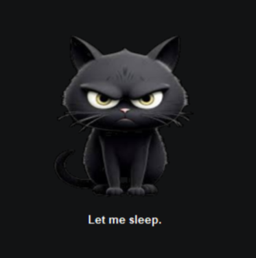
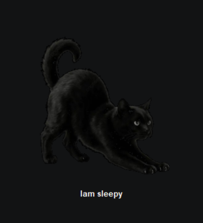
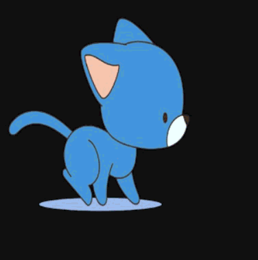

# 🐱 BlackCat Desktop Pet

A desktop pet built with Python and Tkinter as part of my journey learning programming and software development.

BlackCat is a virtual cat companion that lives on the desktop, displays different moods, responds to interaction, and features sprite-based walking animations.

---

## Preview

### Cute Mood



### Angry Mood



### Sleepy Mood


### Walking Animation



---

## Features

### Mood System

* Cute mode
* Angry mode
* Sleepy mode
* Unique messages for each mood

### Autonomous Behaviour

* Random mood selection
* Automatic mood switching
* Self-scheduling behaviour using `after()`

### Interactive Features

* Mouse click interactions
* Mood changes based on petting count
* Event handling using Tkinter bindings

### Visual Features

* Transparent desktop pet window
* Always-on-top desktop companion
* Custom cat artwork
* Sprite-based walking animation using six frames

---

## Technologies Used

* Python
* Tkinter
* Pillow (PIL)

---

## What I Learned

While building BlackCat, I practiced:

* Variables and variable scope
* Functions and function references
* Lists and indexing
* Loops
* Event binding
* GUI programming with Tkinter
* Image handling with Pillow
* Sprite animation
* Random selection using `random.choice()`
* Self-scheduling functions using `after()`
* Debugging and testing
* Basic project organization

---

## Project Structure

```text
Desktop Pet/
│
├── main.py
├── walk_test.py
├── cat.png
├── cat2.png
├── cat3.png
├── walk1.png
├── walk2.png
├── walk3.png
├── walk4.png
├── walk5.png
├── walk6.png
└── README.md
```

---

## Development Journey

BlackCat started as a simple desktop pet that displayed a cat image and random messages.

Over multiple versions, I gradually added:

* Multiple moods
* Autonomous mood switching
* Interactive petting behaviour
* Better project organization
* Walking sprite animations

This project helped me move from learning Python syntax to building a complete project from scratch.

---

## Current Status

✅ BlackCat Version 1 Complete

The original learning goals for this project have been achieved.

Future updates may include:

* Desktop movement
* Additional moods
* Improved animations
* Reminder system
* More interactive behaviours

---

## Author

Created by Farzana as part of a journey into Python programming, software development, and AI/Data Science.
